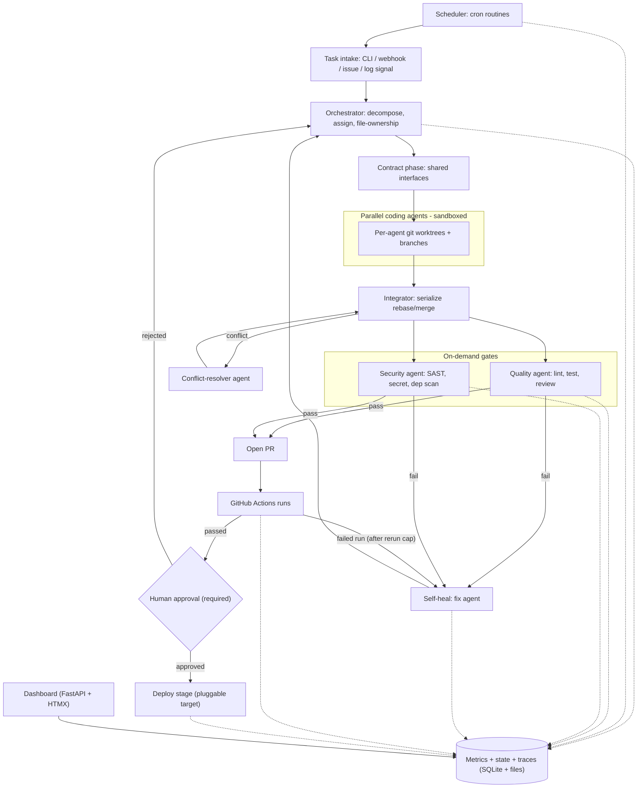

# Self-Building Software Factory - Scaffold & Harness

A generic, GitHub-template-exportable Python scaffold that builds, codes, reviews, error-corrects, and proposes improvements to software autonomously - with deployment as the only mandatory human gate.

## Confirmed decisions

- Engine: provider-pluggable - Cursor SDK and Claude Agent SDK, chosen at bootstrap, overridable per agent role.
- Language: Python 3.12 (matches your Pydantic-oriented coding rules; unifies orchestration, metrics, dashboard).
- Deploy approval: both GitHub Environments required-reviewer (CI) and a local dashboard approval button.
- Export: GitHub template repo + `scripts/init.py` bootstrap.
- Topology: in-repo (default) and control-plane modes, switchable in `factory.yaml`.

## V1 Contract

The safety/scope boundary the scaffold is built and tested against.

### In scope (v1)
- Local-first execution end-to-end (the path you'll test); GitHub Actions workflows are shipped and runnable but the smoke test runs locally.
- Default target = the repo the factory is installed in (in-repo mode), which may be a target app or the factory itself; control-plane (remote target repos) ships as a config switch, fully wired as a follow-up.
- One orchestrated task -> contract phase -> >=2 sandboxed parallel coding agents -> gates -> self-heal -> risk-based merge -> approval-gated deploy.
- Polyglot-by-config gates with Python + Node built-in profiles.
- Self-healing for runtime/CI failures incl. GitHub Actions log review.
- Metrics + traces dashboard; cron scheduler/routines.

### Non-goals (v1)
- Micro-VM isolation (Firecracker/gVisor), multi-tenant hosting, or a hosted control plane.
- Fully autonomous deploys (deploy is always human-gated) and auto-merge of high-risk changes.
- External tracing SaaS (LangSmith/Phoenix) by default - traces stay local.
- Built-in toolchains beyond Python/Node (others via `factory.yaml`).

### Human approval points
- Deploy: always (GitHub Environment required reviewer + local dashboard).
- Merge: risk-based - high-risk changes (workflow edits, dependency upgrades, security-flagged findings, DB migrations, large diffs) require human approval; low-risk auto-merges after gates + CI pass.

### Required GitHub permissions (least privilege, per workflow)
- `factory.yml`: `contents: write`, `pull-requests: write`, `issues: write`, `actions: read`.
- `routines.yml`: `contents: write`, `pull-requests: write`, `issues: write`, `actions: read`.
- `self-heal.yml`: `actions: write` (read logs + rerun), `contents: write`, `pull-requests: write`.
- `deploy.yml`: `contents: read`, `deployments: write`, `id-token: write` (only if OIDC); bound to a protected Environment with required reviewers.

### Security invariants
- Deploy never happens without human approval; high-risk merges never auto-merge.
- Agents execute only inside the sandbox (Docker or confined subprocess), scoped to the worktree; routine `command` actions are allowlisted (exact argv, no shell interpolation).
- Secrets only via `.env`/Actions secrets, never committed; traces/logs are redacted.
- Every external call has a timeout; inputs validated (per the repo coding rules).
- Self-heal is bounded (signature dedupe, attempt cap, backoff); budgets/concurrency caps enforced.

### Gate thresholds (defaults, configurable)
- ruff: zero errors; pytest: all selected tests pass; coverage: >= 80% (or no-regression vs baseline).
- bandit: no High (Medium warns); semgrep: no findings at/above `error`; gitleaks: zero secrets; pip-audit/npm-audit: no High/Critical.
- actionlint: zero errors on changed workflows.

### Acceptance criteria
- `factory init` writes a valid `factory.yaml` + `.env` (provider, topology, models, mcps, sandbox).
- `factory run "<task>"` runs >=2 parallel sandboxed agents in worktrees, integrates with no manual git, passes gates, and opens a PR.
- Breaking a test triggers self-heal -> fix PR; a failed Actions run triggers `ci_review` (rerun transient, else fix PR).
- Low-risk PR auto-merges after gates + CI; a high-risk PR is held for human approval.
- Deploy stays blocked until approved (Environment + dashboard); the no-op deploy hook runs post-approval.
- Dashboard shows runs, daily metrics, routines, and redacted traces.
- Killing the orchestrator mid-run and restarting reconciles worktrees and resumes/fails-forward (no orphans).

### First smoke-test scenario
- In-repo mode on a small sample app; task: "add an endpoint + test". Observe contract -> parallel agents -> gates -> PR -> risk-based merge -> approval-gated no-op deploy, with metrics/traces in the dashboard; then break a test to exercise self-heal.

### Failure modes -> expected behavior
- Agent fails to start (auth/config): retry per backend, surface in dashboard, no partial merge.
- Gate fails: self-heal up to cap; if still failing, leave PR open + `needs-human-review`.
- Merge conflict: conflict-resolver agent; if unresolved after cap, escalate to human.
- Budget exceeded: pause task, mark blocked, notify in dashboard.
- No Docker: fall back to confined subprocess; if neither is safe, refuse to execute.
- Deploy approval timeout: stays pending; nothing deploys.

## Architecture



## Repository layout (template contents)

```
<repo-root>/
  AGENTS.md                 # Factory overview, agent roster, operating rules
  CONTRACT.md               # V1 Contract: scope, invariants, permissions, acceptance criteria
  README.md
  pyproject.toml            # pinned deps (cursor-sdk, claude-agent-sdk, fastapi, pydantic, ...)
  factory.yaml              # config: provider, topology, models, gates+thresholds, budgets, scheduler, selfheal, sandbox, mcps, merge, deploy
  .env.example              # CURSOR_API_KEY / ANTHROPIC_API_KEY / MCP creds, never committed
  .cursor/rules/            # your existing coding/thinking rules + factory-specific rules
  factory/
    config.py               # Pydantic settings (loads factory.yaml + env)
    cli.py                  # `factory run | init | heal | dashboard | scheduler | routine`
    orchestrator.py         # decompose, contract phase, assign, file-ownership map
    integrator.py           # worktree lifecycle + serialized integration
    state.py                # task/assignment/worktree state + crash-resume + reconciliation
    sandbox/executor.py     # Docker / confined-subprocess execution backend
    intake/webhook.py       # optional FastAPI issue/label webhook (CLI intake in cli.py)
    backends/
      base.py               # AgentBackend protocol -> RunResult{output, usage, status}
      cursor_backend.py     # cursor-sdk implementation
      claude_backend.py     # claude-agent-sdk implementation
      registry.py           # per-role provider/model selection
    agents/                 # coder, orchestrator, quality, security, reviewer, log_analyzer, ci_analyzer
    gates/profiles.py       # language detection + Python/Node toolchain profiles + thresholds
    gates/quality.py        # ruff, pytest, coverage, actionlint, LLM review
    gates/security.py       # bandit, semgrep, gitleaks, pip-audit (+ optional MCP plugins)
    gates/merge_policy.py   # risk scoring -> auto-merge vs needs-human-review
    selfheal/loop.py        # failure classification -> fix agent -> PR
    selfheal/ci_review.py   # GitHub Actions: pull failed logs, rerun-then-fix, classify
    selfheal/log_review.py  # daily log review routine -> issues/PRs
    scheduler/runner.py     # APScheduler (SQLite jobstore) daemon; dashboard-embeddable; run-now
    scheduler/routines.py   # action-type registry, built-in catalog, command allowlist
    routines/               # user-defined routine definitions
    metrics/store.py        # SQLite schema + writes (metrics + orchestrator state)
    metrics/usage.py        # token + cost estimation
    metrics/rollup.py       # daily aggregates
    metrics/traces.py       # transcript capture + secret redaction + retention
    deploy/gate.py          # approval check (GH Environment + local)
    deploy/runner.py        # pluggable deploy hook
    dashboard/app.py        # FastAPI + HTMX + Chart.js
  .github/workflows/
    factory.yml             # run loop on issue/dispatch
    routines.yml            # cron-scheduled routines (log review, audits, reports)
    self-heal.yml           # workflow_run failure -> CI review + fix PR
    deploy.yml              # gated by protected Environment (required reviewer)
  scripts/init.py           # interactive bootstrap: provider, topology, mcps, sandbox, secrets
  tests/
  .factory/                 # runtime (gitignored): traces, state db, scheduler jobstore
```

## Core components

- Provider abstraction (`factory/backends/base.py`): a single `AgentBackend` protocol with `run(role, prompt, cwd, mcp_servers, model) -> RunResult` and a normalized `Usage` (prompt/completion tokens, est. cost). Cursor and Claude are concrete backends; `registry.py` resolves provider+model per role from `factory.yaml`. This is what makes "Cursor and Claude, configurable" real.
- Orchestrator + integrator: the orchestrator first runs a contract/planning phase that produces a shared interface/API contract injected into every parallel agent's context, then decomposes the task into work units with a file-ownership map (conflict avoidance); each coder runs in its own sandboxed `git worktree`/branch. The integrator serializes rebase/merge; on conflict it dispatches a conflict-resolver agent, then re-runs gates. Orchestrator state (tasks, assignments, worktree status) is persisted in SQLite so a crash/restart reconciles orphaned worktrees and resumes or fails-forward interrupted tasks.
- Execution sandbox (`factory/sandbox/executor.py`): all autonomous build/test/command execution runs through a pluggable backend - Docker-isolated when available, with a confined-subprocess fallback scoped to the worktree, a command allowlist, and resource/network limits - so a misbehaving agent cannot damage the host.
- Task intake: tasks enter via the CLI (`factory run "..."`, `factory run --issue <n>`), an optional FastAPI webhook for GitHub issue/label events, or event-driven self-heal triggers; all are normalized into the same task object the orchestrator consumes.
- On-demand gates: a language profile is autodetected per target (Python + Node built-in; others defined as commands in `factory.yaml`), then quality (ruff, pytest, coverage, `actionlint`, LLM diff review) and security (bandit, semgrep, gitleaks, pip-audit/npm-audit) run with explicit pass/fail thresholds (see V1 Contract). `actionlint` also runs proactively on any workflow-file change to catch Actions errors before they run. Your existing security MCPs (Wiz, Orca, SonarQube, GitGuardian) are wired as optional plugins, off by default.
- Self-healing: `selfheal/loop.py` classifies failures and spawns a fix agent that opens a PR. `selfheal/ci_review.py` adds dedicated GitHub Actions healing - triggered by a `workflow_run` failure event (and a polling routine for local/control-plane), it pulls failed-job logs (`gh run view --log-failed` / API), classifies the failure (workflow YAML, build, test, lint/type, dependency, transient, infra), auto-reruns transient/flaky failures up to a configurable cap, and only then proposes a fix PR. Edits to `.github/workflows/*` get stricter handling: a mandatory security gate plus a `needs-human-review` label. Loop guardrails (error-signature dedupe, per-signature attempt cap, exponential backoff) prevent runaway healing, and all fixes still flow through gates -> PR -> the human deploy gate. `selfheal/log_review.py` is packaged as a built-in scheduler routine that reviews logs and files improvement issues/PRs. In in-repo mode all of this can target the factory's own repo (satisfies "build/error-correct itself").
- Scheduler & routines: a cron-like scheduler (APScheduler + SQLite jobstore) runs configurable routines defined in `factory.yaml` under `schedules:`. A single global `scheduler.runner` switch selects where routines execute: `local` runs them in the `factory scheduler` daemon (optionally embedded in the dashboard via `--with-scheduler`); `ci` runs them via a generated `routines.yml` (`on: schedule`) - so a routine never double-fires. Action types: `task` (full pipeline), `agent` (single prompt), `gate` (scan/report), `report` (metrics summary), `maintenance` (built-ins: log review, dependency audit->PR, stale-branch cleanup), and `command` restricted to an explicit `command_allowlist` (exact argv, no shell-string interpolation). Overlap is skip-if-running (`max_instances=1`, `coalesce=true`); default timezone UTC. Routines can be triggered manually (CLI/dashboard run-now), are logged to metrics, and any code changes still flow through gates -> PR -> the human deploy gate (deploy stays gated).
- Metrics + dashboard: every agent run is logged (role, provider, model, tokens, duration, est. cost, outcome). Daily rollups expose fixes, commits, PRs, agents spawned, tokens, est. cost, gate pass-rate, conflicts resolved, and self-heal MTTR. FastAPI + HTMX/Chart.js renders live runs + daily summary from SQLite (which also holds orchestrator state), a routines view (enabled routines, next/last run, history, run-now), and a traces view that surfaces redacted per-run transcripts for debugging. Kept deliberately simple, no heavy frontend build.
- Tracing: each agent run writes a redacted transcript (prompts, tool calls, LLM responses) to `.factory/traces/` with a retention policy; secrets are scrubbed before write. Local by default - no external tracing SaaS.
- Merge policy & HITL: PRs are risk-scored; low-risk changes auto-merge once gates + CI pass, while high-risk changes (workflow edits, dependency upgrades, security-flagged, migrations, large diffs) are held with a `needs-human-review` label. Deploy remains a separate, always-mandatory human gate.
- Deploy gate (mandatory human): `deploy.yml` binds to a protected GitHub Environment with required reviewers; the local dashboard exposes an "Approve deploy" action that triggers the same workflow. Deploy target itself is a pluggable hook (`deploy/runner.py`) so the scaffold stays generic.
- Bootstrap/export: repo is a GitHub template; `scripts/init.py` interactively sets provider, topology (in-repo vs control-plane), per-role models, budgets, sandbox mode, and MCP servers (`mcps:`), then writes `factory.yaml` + `.env`.

## Configuration and secrets

- `factory.yaml`: `provider` default + per-role overrides, `topology` (in_repo|control_plane), `models`, `gates` (language profiles, toggles, thresholds), `budgets` (max tokens/cost, max concurrency), `sandbox` (mode docker|subprocess, resource/network limits), `scheduler` (global `runner: local|ci`, `command_allowlist`, SQLite jobstore, default timezone UTC), `schedules` (named routines: cron, timezone, `action` {type/ref/params}, budget, on_failure, enabled), `selfheal` (`ci_review` on/off, `max_reruns`, `max_fix_attempts` per signature, `workflow_edit_policy`, `pr_token: github_token|app|pat`), `merge` (risk rules + thresholds), `mcps` (per-server transport/config, env credential refs, toggles), `tracing` (retention, redaction), `deploy` hook + environment name.
- Secrets: `.env` locally and GitHub Actions secrets in CI; `.env.example` documents required keys incl. MCP credentials (referenced by env var, never inline); nothing secret committed; traces are redacted before write.
- Budgets + concurrency caps prevent runaway token spend.

## Defaults I will apply unless you object

- Dashboard: FastAPI + SQLite + HTMX/Chart.js (simple, dependency-light).
- Default models: Cursor `composer-2.5` and a current Claude model, both overridable in `factory.yaml` (no exotic IDs hardcoded).
- Control-plane mode ships as a config switch with the in-repo execution path implemented first; remote control-plane execution lands through the same interface as a follow-up.
- Scheduler: APScheduler + SQLite jobstore. Global `scheduler.runner` switch - `local` runs the `factory scheduler` daemon (optionally embedded in the dashboard via `--with-scheduler`), `ci` generates the `routines.yml` cron - so routines run in exactly one place. `command` actions are restricted to an explicit `command_allowlist` (exact argv, no shell interpolation); overlap = skip-if-running; default timezone UTC.
- CI self-healing: reactive (on `workflow_run` failure) + proactive (`actionlint`). Transient failures auto-rerun up to 2 times before a fix PR is proposed. Workflow-file edits require the security gate + a `needs-human-review` label. Fix PRs use `GITHUB_TOKEN` by default (which won't auto-trigger CI on the fix PR); a GitHub App/PAT can be configured via `selfheal.pr_token` when you want fix PRs re-validated automatically. Guardrails: signature dedupe, per-signature attempt cap, exponential backoff.
- Merge: risk-based - auto-merge low-risk changes after gates + CI; require human approval for workflow edits, dependency upgrades, security-flagged findings, migrations, and large diffs.
- Sandbox: Docker-isolated when available, else a confined subprocess (worktree-scoped, command allowlist, resource/network limits).
- Target languages: polyglot-by-config with Python + Node built-in gate profiles; other languages added via `factory.yaml`.
- Smoke-test deploy: a no-op/dry-run hook that exercises the approval gate without real infrastructure (swap in your real target later).
- Tracing: local `.factory/traces/` with redaction + retention; no external tracing SaaS by default.
- v1 is a complete vertical slice so you can immediately test it on one app: intake -> contract -> sandboxed parallel coding -> gates -> self-heal -> risk-based merge -> approval-gated deploy -> dashboard.

## How you'll test it

After the scaffold lands, point it at a single small app (in-repo mode): run `factory run` with a task/issue, watch parallel agents + gates in the dashboard, trigger a deliberate failure to see self-heal open a fix PR, then exercise the human approval -> deploy gate.